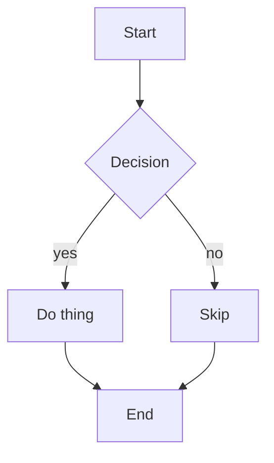

# md2pdf Decomposition + Integration Tests — Implementation Plan

> **For agentic workers:** REQUIRED SUB-SKILL: Use superpowers:subagent-driven-development (recommended) or superpowers:executing-plans to implement this plan task-by-task. Steps use checkbox (`- [ ]`) syntax for tracking.

**Goal:** Split `md2pdf.py` into a readable `src/md2pdf/` package and add a detailed pytest integration suite, with zero behavior change.

**Architecture:** Extract the 8 comment-delimited sections of `md2pdf.py` into focused modules under `src/md2pdf/`. Keep a thin root `md2pdf.py` shim that path-inserts `src/` and re-exports the public API, so `./md2pdf.py`, `make`, and `_check.py`'s `import md2pdf` keep working. Tests import the package directly via `pythonpath = src`.

**Tech Stack:** Python 3.14, pytest, pandoc + xelatex (TinyTeX) + Graphviz `dot`, PyYAML. All resolved from the local `.bin/`/`.tools/`/`.venv` install layout.

**Source of truth for extraction:** the current `md2pdf.py` (580 lines). Each extraction task cites the exact line range to move verbatim, changing only the import header shown.

---

### Task 0: Git snapshot (rollback safety net)

Not currently a git repo. A behavior-preserving refactor needs a clean baseline to diff against.

- [ ] **Step 1: Init + snapshot**

```bash
cd /Users/chaoticqubit/Tools/MD2PDF
git init -q
git add -A
git commit -q -m "chore: snapshot before src/ decomposition"
```

- [ ] **Step 2: Verify**

Run: `git log --oneline -1`
Expected: one commit `chore: snapshot before src/ decomposition`. `.gitignore` already excludes `.venv/.tools/.bin/node_modules`.

---

### Task 1: Package scaffold + pytest infra

**Files:**
- Create: `src/md2pdf/__init__.py` (temporary minimal — finalized in Task 10)
- Create: `pytest.ini`
- Create: `tests/__init__.py` (empty)
- Modify: `.venv` (install pytest)

- [ ] **Step 1: Install pytest into the venv**

Run: `.venv/bin/python -m pip install -q pytest`
Expected: pytest installed (no error). Verify: `.venv/bin/python -m pytest --version`.

- [ ] **Step 2: Create `pytest.ini`**

```ini
[pytest]
testpaths = tests
pythonpath = src
addopts = -ra
```

- [ ] **Step 3: Create minimal `src/md2pdf/__init__.py`**

```python
"""md2pdf package. Public API re-exported here (finalized in Task 10)."""
```

- [ ] **Step 4: Create empty `tests/__init__.py`**

(empty file)

- [ ] **Step 5: Verify pytest collects nothing yet**

Run: `.venv/bin/python -m pytest -q`
Expected: `no tests ran`.

- [ ] **Step 6: Commit**

```bash
git add pytest.ini src/md2pdf/__init__.py tests/__init__.py
git commit -q -m "test: add pytest infra + package scaffold"
```

---

### Task 2: `paths.py` — project layout + venv bootstrap

**Files:**
- Create: `src/md2pdf/paths.py`
- Test: `tests/test_paths.py`

- [ ] **Step 1: Write failing test**

```python
# tests/test_paths.py
from pathlib import Path
import md2pdf.paths as paths


def test_project_root_is_repo_root():
    # PROJECT_ROOT must point at the repo root, where .bin / md2pdf.yaml live.
    assert (paths.PROJECT_ROOT / "md2pdf.yaml").exists()
    assert (paths.PROJECT_ROOT / "src" / "md2pdf").is_dir()


def test_local_dirs_derive_from_root():
    assert paths.LOCAL_BIN == paths.PROJECT_ROOT / ".bin"
    assert paths.LOCAL_TOOLS == paths.PROJECT_ROOT / ".tools"
    assert paths.LOCAL_NPM_BIN == paths.PROJECT_ROOT / "node_modules" / ".bin"
    assert paths.LOCAL_VENV == paths.PROJECT_ROOT / ".venv"


def test_ensure_venv_yaml_importable():
    paths.ensure_venv_yaml()
    import yaml  # noqa: F401
```

- [ ] **Step 2: Run — expect fail**

Run: `.venv/bin/python -m pytest tests/test_paths.py -q`
Expected: FAIL — `ModuleNotFoundError: No module named 'md2pdf.paths'`.

- [ ] **Step 3: Create `src/md2pdf/paths.py`**

Move lines **50-75** of the original `md2pdf.py` (the `PROJECT_ROOT … _ensure_venv_yaml()` block) into this file, with these changes:
- `PROJECT_ROOT = Path(__file__).resolve().parents[2]` (was `.parent`; now `paths.py → md2pdf → src → root`).
- Rename `_ensure_venv_yaml` → `ensure_venv_yaml` (public).
- Do NOT call it at module level here (Task 10 calls it from `__init__`).

```python
"""Project layout + lazy PyYAML bootstrap from the local .venv."""
from __future__ import annotations

import sys
from pathlib import Path

PROJECT_ROOT = Path(__file__).resolve().parents[2]
LOCAL_BIN     = PROJECT_ROOT / ".bin"
LOCAL_TOOLS   = PROJECT_ROOT / ".tools"
LOCAL_NPM_BIN = PROJECT_ROOT / "node_modules" / ".bin"
LOCAL_VENV    = PROJECT_ROOT / ".venv"


def ensure_venv_yaml() -> None:
    """If PyYAML is missing but .venv has it, add .venv site-packages to sys.path."""
    try:
        import yaml  # noqa: F401
        return
    except ImportError:
        pass
    for p in LOCAL_VENV.glob("lib/python*/site-packages"):
        sys.path.insert(0, str(p))
    try:
        import yaml  # noqa: F401
    except ImportError:
        sys.stderr.write(
            "WARN: PyYAML not found. Config file will be ignored. "
            "Run ./install.sh to set up the venv with PyYAML.\n"
        )
```

- [ ] **Step 4: Run — expect pass**

Run: `.venv/bin/python -m pytest tests/test_paths.py -q`
Expected: 3 passed.

- [ ] **Step 5: Commit**

```bash
git add src/md2pdf/paths.py tests/test_paths.py
git commit -q -m "refactor: extract paths module"
```

---

### Task 3: `config.py` — defaults, merge, loader

**Files:**
- Create: `src/md2pdf/config.py`
- Test: `tests/test_config.py`

- [ ] **Step 1: Write failing test**

```python
# tests/test_config.py
import textwrap
from pathlib import Path
import argparse
import md2pdf.config as config


def test_deep_merge_override_wins_and_preserves():
    base = {"a": 1, "b": {"x": 1, "y": 2}}
    over = {"b": {"y": 99}, "c": 3}
    out = config.deep_merge(base, over)
    assert out == {"a": 1, "b": {"x": 1, "y": 99}, "c": 3}


def test_deep_merge_nondict_replaces_dict():
    assert config.deep_merge({"a": {"x": 1}}, {"a": 5}) == {"a": 5}


def test_load_config_defaults_when_none(tmp_path):
    md = tmp_path / "doc.md"
    md.write_text("# hi")
    cfg = config.load_config(None, md)
    assert cfg["page"]["margin"] == "0.85in"
    assert cfg["output"]["toc"] is True


def test_load_config_sibling_yaml_overrides(tmp_path):
    (tmp_path / "md2pdf.yaml").write_text(
        textwrap.dedent("""
        page:
          margin: 2in
        """)
    )
    md = tmp_path / "doc.md"
    md.write_text("# hi")
    cfg = config.load_config(None, md)
    assert cfg["page"]["margin"] == "2in"
    assert cfg["page"]["fontsize"] == "10.5pt"  # default preserved


def test_load_config_malformed_yaml_falls_back(tmp_path, capsys):
    bad = tmp_path / "bad.yaml"
    bad.write_text("page: [unclosed")
    md = tmp_path / "doc.md"
    md.write_text("# hi")
    cfg = config.load_config(bad, md)
    assert cfg["page"]["margin"] == "0.85in"
    assert "WARN" in capsys.readouterr().err
```

- [ ] **Step 2: Run — expect fail** (`ModuleNotFoundError: md2pdf.config`).

Run: `.venv/bin/python -m pytest tests/test_config.py -q`

- [ ] **Step 3: Create `src/md2pdf/config.py`**

Move lines **82-187** of the original (`DEFAULTS`, `deep_merge`, `load_config`) verbatim. Header:

```python
"""Configuration: built-in defaults, deep merge, YAML loader."""
from __future__ import annotations

import sys
from pathlib import Path
from typing import Any

from .paths import PROJECT_ROOT
```

`load_config` keeps its inline `import yaml` (works because `ensure_venv_yaml` ran at package import). `DEFAULTS`, `deep_merge`, `load_config` bodies unchanged.

- [ ] **Step 4: Run — expect pass** (5 passed).

Run: `.venv/bin/python -m pytest tests/test_config.py -q`

- [ ] **Step 5: Commit**

```bash
git add src/md2pdf/config.py tests/test_config.py
git commit -q -m "refactor: extract config module"
```

---

### Task 4: `binaries.py` — executable resolution

**Files:**
- Create: `src/md2pdf/binaries.py`
- Test: `tests/test_binaries.py`

- [ ] **Step 1: Write failing test**

```python
# tests/test_binaries.py
import os
import stat
from pathlib import Path
import md2pdf.binaries as binaries


def _make_exe(p: Path):
    p.parent.mkdir(parents=True, exist_ok=True)
    p.write_text("#!/bin/sh\necho hi\n")
    p.chmod(p.stat().st_mode | stat.S_IEXEC)


def test_override_existing_wins(tmp_path):
    exe = tmp_path / "mybin"
    _make_exe(exe)
    assert binaries.resolve_binary("pandoc", str(exe)) == str(exe)


def test_override_missing_returns_none(tmp_path):
    assert binaries.resolve_binary("pandoc", str(tmp_path / "nope")) is None


def test_order_bin_before_path(tmp_path, monkeypatch):
    binp = tmp_path / ".bin" / "pandoc"
    _make_exe(binp)
    monkeypatch.setattr(binaries, "LOCAL_BIN", tmp_path / ".bin")
    monkeypatch.setattr(binaries, "LOCAL_NPM_BIN", tmp_path / "nm")
    monkeypatch.setattr(binaries, "LOCAL_TOOLS", tmp_path / ".tools")
    monkeypatch.setattr(binaries.shutil, "which", lambda n: "/usr/bin/pandoc")
    assert binaries.resolve_binary("pandoc") == str(binp)


def test_falls_through_to_path(tmp_path, monkeypatch):
    monkeypatch.setattr(binaries, "LOCAL_BIN", tmp_path / ".bin")
    monkeypatch.setattr(binaries, "LOCAL_NPM_BIN", tmp_path / "nm")
    monkeypatch.setattr(binaries, "LOCAL_TOOLS", tmp_path / ".tools")
    monkeypatch.setattr(binaries.shutil, "which", lambda n: "/usr/bin/" + n)
    assert binaries.resolve_binary("xelatex") == "/usr/bin/xelatex"


def test_tools_rglob_finds_nested(tmp_path, monkeypatch):
    nested = tmp_path / ".tools" / "tex" / "bin" / "xelatex"
    _make_exe(nested)
    monkeypatch.setattr(binaries, "LOCAL_BIN", tmp_path / ".bin")
    monkeypatch.setattr(binaries, "LOCAL_NPM_BIN", tmp_path / "nm")
    monkeypatch.setattr(binaries, "LOCAL_TOOLS", tmp_path / ".tools")
    monkeypatch.setattr(binaries.shutil, "which", lambda n: None)
    assert binaries.resolve_binary("xelatex") == str(nested)
```

- [ ] **Step 2: Run — expect fail** (`ModuleNotFoundError`).

- [ ] **Step 3: Create `src/md2pdf/binaries.py`**

Move lines **194-211** (`resolve_binary`) verbatim. Header:

```python
"""Resolve an executable across the local install layout, then PATH."""
from __future__ import annotations

import os
import shutil
from pathlib import Path

from .paths import LOCAL_BIN, LOCAL_TOOLS, LOCAL_NPM_BIN
```

> Note: tests monkeypatch `binaries.LOCAL_BIN` etc. and `binaries.shutil.which`. Because the function body references the module-level names `LOCAL_BIN`/`LOCAL_NPM_BIN`/`LOCAL_TOOLS` and `shutil.which`, patching the module attributes works. Keep the body exactly as the original (it reads those names at call time).

- [ ] **Step 4: Run — expect pass** (5 passed).

- [ ] **Step 5: Commit**

```bash
git add src/md2pdf/binaries.py tests/test_binaries.py
git commit -q -m "refactor: extract binaries module"
```

---

### Task 5: `mermaid.py` — extraction + dot conversion

**Files:**
- Create: `src/md2pdf/mermaid.py`
- Test: `tests/test_mermaid.py`

- [ ] **Step 1: Write failing test**

```python
# tests/test_mermaid.py
import md2pdf.mermaid as mm


def test_extract_caption_title_hint():
    assert mm.extract_caption("flowchart TD\ntitle My Flow", "fb") == "My Flow"


def test_extract_caption_bracket():
    assert mm.extract_caption("graph LR\nA[Start Node]", "fb") == "Start Node"


def test_extract_caption_fallback():
    assert mm.extract_caption("sequenceDiagram\n  A->>B: hi", "Diagram 3") == "Diagram 3"


def test_mermaid_to_dot_basic_flow():
    dot = mm.mermaid_to_dot("flowchart TD\nA[Start] --> B[End]")
    assert dot is not None
    assert "digraph G {" in dot
    assert "rankdir=TB;" in dot
    assert 'A [label="Start"];' in dot
    assert 'B [label="End"];' in dot
    assert "A -> B;" in dot


def test_mermaid_to_dot_styles_and_label():
    dot = mm.mermaid_to_dot("graph LR\nA -.-> B\nB ==>|go| C")
    assert "rankdir=LR;" in dot
    assert "style=dashed" in dot
    assert "style=bold" in dot
    assert 'label="go"' in dot


def test_mermaid_to_dot_rejects_non_flowchart():
    assert mm.mermaid_to_dot("sequenceDiagram\n A->>B: x") is None
    assert mm.mermaid_to_dot("   ") is None


def test_mermaid_re_matches_block():
    md = "intro\n```mermaid\nflowchart TD\nA-->B\n```\nout"
    blocks = list(mm.MERMAID_RE.finditer(md))
    assert len(blocks) == 1
    assert "flowchart TD" in blocks[0].group(1)
```

- [ ] **Step 2: Run — expect fail** (`ModuleNotFoundError`).

- [ ] **Step 3: Create `src/md2pdf/mermaid.py`**

Combine, verbatim: lines **218-234** (`MERMAID_RE`, `CAPTION_HINT_RE`, `extract_caption`) and lines **267-345** (`MERMAID_EDGE_RE`, `MERMAID_NODE_RE`, `mermaid_to_dot`). Header:

```python
"""Mermaid block extraction, caption heuristics, and dot fallback conversion."""
from __future__ import annotations

import re
```

Order inside file: `MERMAID_RE`, `CAPTION_HINT_RE`, `extract_caption`, then `MERMAID_EDGE_RE`, `MERMAID_NODE_RE`, `mermaid_to_dot`.

- [ ] **Step 4: Run — expect pass** (7 passed).

- [ ] **Step 5: Commit**

```bash
git add src/md2pdf/mermaid.py tests/test_mermaid.py
git commit -q -m "refactor: extract mermaid module"
```

---

### Task 6: `renderers.py` — png renderers + chain

**Files:**
- Create: `src/md2pdf/renderers.py`
- Test: `tests/test_renderers.py`

- [ ] **Step 1: Write failing test**

```python
# tests/test_renderers.py
import stat
from pathlib import Path
import md2pdf.renderers as rnd

CFG = {
    "mermaid": {"theme": "default", "background": "white", "prefer": "auto"},
    "images": {"dpi": 120, "mmdc_width": 1600, "mmdc_height": 1100},
}


def test_render_block_auto_prefers_mmdc_when_present(monkeypatch):
    calls = []
    monkeypatch.setattr(rnd, "render_via_mmdc",
                        lambda *a, **k: calls.append("mmdc") or True)
    monkeypatch.setattr(rnd, "render_via_dot",
                        lambda *a, **k: calls.append("dot") or True)
    ok, who = rnd.render_block("flowchart TD\nA-->B", Path("x.png"), CFG, "mmdc", "dot")
    assert (ok, who) == (True, "mmdc")
    assert calls == ["mmdc"]


def test_render_block_prefer_dot(monkeypatch):
    monkeypatch.setattr(rnd, "render_via_mmdc", lambda *a, **k: True)
    monkeypatch.setattr(rnd, "render_via_dot", lambda *a, **k: True)
    cfg = {**CFG, "mermaid": {**CFG["mermaid"], "prefer": "dot"}}
    ok, who = rnd.render_block("flowchart TD\nA-->B", Path("x.png"), cfg, "mmdc", "dot")
    assert (ok, who) == (True, "dot")


def test_render_block_falls_through_then_fails(monkeypatch):
    monkeypatch.setattr(rnd, "render_via_mmdc", lambda *a, **k: False)
    monkeypatch.setattr(rnd, "render_via_dot", lambda *a, **k: False)
    ok, who = rnd.render_block("flowchart TD\nA-->B", Path("x.png"), CFG, "mmdc", "dot")
    assert (ok, who) == (False, "none")


def _fake_dot(tmp_path: Path) -> str:
    # stub `dot`: reads stdin, writes a 1x1 PNG to the -o argument
    script = tmp_path / "dot"
    script.write_text(
        "#!/usr/bin/env python3\n"
        "import sys\n"
        "out=sys.argv[sys.argv.index('-o')+1]\n"
        "sys.stdin.read()\n"
        "open(out,'wb').write(bytes.fromhex('89504e470d0a1a0a'))\n"
    )
    script.chmod(script.stat().st_mode | stat.S_IEXEC)
    return str(script)


def test_render_via_dot_invokes_stub(tmp_path):
    out = tmp_path / "d.png"
    ok = rnd.render_via_dot("flowchart TD\nA[Start]-->B[End]", out, CFG, _fake_dot(tmp_path))
    assert ok is True
    assert out.exists() and out.stat().st_size > 0
```

- [ ] **Step 2: Run — expect fail** (`ModuleNotFoundError`).

- [ ] **Step 3: Create `src/md2pdf/renderers.py`**

Move verbatim: lines **241-264** (`render_via_mmdc`), **348-357** (`render_via_dot`), **360-375** (`render_block`). Header:

```python
"""Diagram renderers: mmdc (preferred) and Graphviz dot (flowchart fallback)."""
from __future__ import annotations

import os
import subprocess
import sys
import tempfile
from pathlib import Path

from .mermaid import mermaid_to_dot
```

- [ ] **Step 4: Run — expect pass** (4 passed).

- [ ] **Step 5: Commit**

```bash
git add src/md2pdf/renderers.py tests/test_renderers.py
git commit -q -m "refactor: extract renderers module"
```

---

### Task 7: `pandoc.py` — command builder

**Files:**
- Create: `src/md2pdf/pandoc.py`
- Test: `tests/test_pandoc_cmd.py`

- [ ] **Step 1: Write failing test**

```python
# tests/test_pandoc_cmd.py
import copy
from pathlib import Path
import md2pdf.pandoc as pandoc
from md2pdf.config import DEFAULTS, deep_merge


def _cmd(over=None):
    cfg = deep_merge(DEFAULTS, over or {})
    return pandoc.build_pandoc_cmd(Path("in.md"), Path("out.pdf"), cfg, "pandoc", "xelatex")


def test_defaults_include_core_flags():
    cmd = _cmd()
    assert "--pdf-engine=xelatex" in cmd
    assert "geometry:margin=0.85in" in cmd
    assert "--toc" in cmd
    assert "--toc-depth=2" in cmd
    assert "--highlight-style=tango" in cmd


def test_fonts_none_omitted_set_emitted():
    assert not any("mainfont" in c for c in _cmd())
    cmd = _cmd({"fonts": {"main": "Helvetica", "cjk": "Noto"}})
    assert "mainfont=Helvetica" in cmd
    assert "CJKmainfont=Noto" in cmd


def test_no_toc_and_landscape_and_sections():
    cmd = _cmd({"output": {"toc": False, "number_sections": True},
                "page": {"orientation": "landscape"}})
    assert "--toc" not in cmd
    assert "--number-sections" in cmd
    assert "classoption=landscape" in cmd


def test_citeproc_listings_headerincludes_extra():
    cmd = _cmd({"output": {"citation_processing": True},
                "code": {"line_numbers": True},
                "advanced": {"pandoc_extra_args": ["--standalone"]}})
    assert "--citeproc" in cmd
    assert "--listings" in cmd
    assert "--standalone" in cmd
    assert any(c.startswith("header-includes=") for c in cmd)
```

- [ ] **Step 2: Run — expect fail** (`ModuleNotFoundError`).

- [ ] **Step 3: Create `src/md2pdf/pandoc.py`**

Move lines **382-422** (`build_pandoc_cmd`) verbatim. Header:

```python
"""Build the pandoc invocation from resolved config."""
from __future__ import annotations

from pathlib import Path
```

- [ ] **Step 4: Run — expect pass** (4 passed).

- [ ] **Step 5: Commit**

```bash
git add src/md2pdf/pandoc.py tests/test_pandoc_cmd.py
git commit -q -m "refactor: extract pandoc command builder"
```

---

### Task 8: `pipeline.py` — the build orchestrator (core hermetic integration)

**Files:**
- Create: `src/md2pdf/pipeline.py`
- Test: `tests/test_pipeline.py`

- [ ] **Step 1: Write failing test**

```python
# tests/test_pipeline.py
import json
import stat
from pathlib import Path
import pytest
import md2pdf.pipeline as pipeline
from md2pdf.config import DEFAULTS, deep_merge


def _fake_pandoc(tmp_path: Path) -> str:
    p = tmp_path / "pandoc"
    p.write_text(
        "#!/usr/bin/env python3\n"
        "import sys\n"
        "out=sys.argv[sys.argv.index('-o')+1]\n"
        "open(out,'wb').write(b'%PDF-1.5 fake')\n"
    )
    p.chmod(p.stat().st_mode | stat.S_IEXEC)
    return str(p)


def _patch_bins(monkeypatch, tmp_path, mmdc="mmdc", dot="dot"):
    pan = _fake_pandoc(tmp_path)
    def fake_resolve(name, override=None):
        return {"pandoc": pan, "xelatex": "xelatex", "mmdc": mmdc, "dot": dot}[name]
    monkeypatch.setattr(pipeline, "resolve_binary", fake_resolve)


def _make_md(tmp_path: Path, body: str) -> Path:
    md = tmp_path / "doc.md"
    md.write_text(body)
    return md


MD = "# Title\n\n```mermaid\nflowchart TD\nA[Start]-->B[End]\n```\n\nafter\n"


def test_build_embeds_figure_and_caption(monkeypatch, tmp_path):
    _patch_bins(monkeypatch, tmp_path)
    # render_block succeeds and writes a stub png
    def fake_render(src, png, cfg, mmdc_bin, dot_bin):
        Path(png).write_bytes(b"\x89PNG")
        return True, "dot"
    monkeypatch.setattr(pipeline, "render_block", fake_render)
    md = _make_md(tmp_path, MD)
    cfg = deep_merge(DEFAULTS, {"advanced": {"keep_intermediate": True}})
    rc = pipeline.build(md, tmp_path / "out.pdf", cfg)
    assert rc == 0
    assert (tmp_path / "out.pdf").read_bytes().startswith(b"%PDF")
    rewritten = (tmp_path / "doc._md2pdf.md").read_text()
    assert "" in rewritten
    assert "Figure 1: Start." in rewritten


def test_on_failure_keep_source(monkeypatch, tmp_path):
    _patch_bins(monkeypatch, tmp_path)
    monkeypatch.setattr(pipeline, "render_block", lambda *a: (False, "none"))
    md = _make_md(tmp_path, MD)
    cfg = deep_merge(DEFAULTS, {"advanced": {"keep_intermediate": True}})
    pipeline.build(md, tmp_path / "out.pdf", cfg)
    rewritten = (tmp_path / "doc._md2pdf.md").read_text()
    assert "Mermaid source preserved" in rewritten
    assert "flowchart TD" in rewritten


def test_on_failure_omit(monkeypatch, tmp_path):
    _patch_bins(monkeypatch, tmp_path)
    monkeypatch.setattr(pipeline, "render_block", lambda *a: (False, "none"))
    md = _make_md(tmp_path, MD)
    cfg = deep_merge(DEFAULTS, {"mermaid": {"on_failure": "omit"},
                                "advanced": {"keep_intermediate": True}})
    pipeline.build(md, tmp_path / "out.pdf", cfg)
    rewritten = (tmp_path / "doc._md2pdf.md").read_text()
    assert "flowchart TD" not in rewritten


def test_on_failure_error_exits(monkeypatch, tmp_path):
    _patch_bins(monkeypatch, tmp_path)
    monkeypatch.setattr(pipeline, "render_block", lambda *a: (False, "none"))
    md = _make_md(tmp_path, MD)
    cfg = deep_merge(DEFAULTS, {"mermaid": {"on_failure": "error"}})
    with pytest.raises(SystemExit):
        pipeline.build(md, tmp_path / "out.pdf", cfg)


def test_emit_manifest(monkeypatch, tmp_path):
    _patch_bins(monkeypatch, tmp_path)
    monkeypatch.setattr(pipeline, "render_block",
                        lambda *a: (Path(a[1]).write_bytes(b"\x89PNG"), True, "dot")[1:])
    md = _make_md(tmp_path, MD)
    cfg = deep_merge(DEFAULTS, {"advanced": {"emit_manifest": True}})
    pipeline.build(md, tmp_path / "out.pdf", cfg)
    man = json.loads((tmp_path / "doc._md2pdf.json").read_text())
    assert man[0]["renderer"] == "dot" and man[0]["ok"] is True
    assert man[0]["caption"] == "Start"


def test_no_clobber_refuses(monkeypatch, tmp_path):
    _patch_bins(monkeypatch, tmp_path)
    monkeypatch.setattr(pipeline, "render_block", lambda *a: (True, "dot"))
    out = tmp_path / "out.pdf"
    out.write_text("existing")
    md = _make_md(tmp_path, MD)
    cfg = deep_merge(DEFAULTS, {"advanced": {"no_clobber": True}})
    with pytest.raises(SystemExit):
        pipeline.build(md, out, cfg)


def test_missing_pandoc_exits(monkeypatch, tmp_path):
    def fake_resolve(name, override=None):
        return None if name == "pandoc" else "x"
    monkeypatch.setattr(pipeline, "resolve_binary", fake_resolve)
    md = _make_md(tmp_path, MD)
    with pytest.raises(SystemExit):
        pipeline.build(md, tmp_path / "out.pdf", deep_merge(DEFAULTS, {}))


def test_keep_intermediate_false_deletes(monkeypatch, tmp_path):
    _patch_bins(monkeypatch, tmp_path)
    def fake_render(src, png, cfg, mmdc_bin, dot_bin):
        Path(png).write_bytes(b"\x89PNG")
        return True, "dot"
    monkeypatch.setattr(pipeline, "render_block", fake_render)
    md = _make_md(tmp_path, MD)
    pipeline.build(md, tmp_path / "out.pdf", deep_merge(DEFAULTS, {}))
    assert not (tmp_path / "doc._md2pdf.md").exists()
```

- [ ] **Step 2: Run — expect fail** (`ModuleNotFoundError`).

- [ ] **Step 3: Create `src/md2pdf/pipeline.py`**

Move lines **425-523** (`build`) verbatim. Header:

```python
"""End-to-end build: render diagrams, rewrite markdown, run pandoc."""
from __future__ import annotations

import json
import subprocess
import sys
from pathlib import Path

from .binaries import resolve_binary
from .mermaid import MERMAID_RE, extract_caption
from .renderers import render_block
from .pandoc import build_pandoc_cmd
```

> Body unchanged. Tests monkeypatch `pipeline.resolve_binary` and `pipeline.render_block`, which works because `build` calls those names at module scope.

- [ ] **Step 4: Run — expect pass** (8 passed).

Run: `.venv/bin/python -m pytest tests/test_pipeline.py -q`

- [ ] **Step 5: Commit**

```bash
git add src/md2pdf/pipeline.py tests/test_pipeline.py
git commit -q -m "refactor: extract pipeline module + integration tests"
```

---

### Task 9: `cli.py` — argparse + overrides + main

**Files:**
- Create: `src/md2pdf/cli.py`
- Test: `tests/test_cli.py`

- [ ] **Step 1: Write failing test**

```python
# tests/test_cli.py
from pathlib import Path
import pytest
import md2pdf.cli as cli
from md2pdf.config import DEFAULTS, deep_merge


def test_apply_cli_overrides_each_flag():
    import argparse
    cfg = deep_merge(DEFAULTS, {})
    args = argparse.Namespace(no_toc=True, toc_depth=4, margin="2in",
                              fontsize="12pt", keep_intermediate=True, theme="forest")
    out = cli.apply_cli_overrides(cfg, args)
    assert out["output"]["toc"] is False
    assert out["output"]["toc_depth"] == 4
    assert out["page"]["margin"] == "2in"
    assert out["page"]["fontsize"] == "12pt"
    assert out["advanced"]["keep_intermediate"] is True
    assert out["mermaid"]["theme"] == "forest"


def test_apply_cli_overrides_noops_when_unset():
    import argparse
    cfg = deep_merge(DEFAULTS, {})
    args = argparse.Namespace(no_toc=False, toc_depth=None, margin=None,
                              fontsize=None, keep_intermediate=False, theme=None)
    out = cli.apply_cli_overrides(cfg, args)
    assert out["output"]["toc"] is True
    assert out["page"]["margin"] == "0.85in"


def test_main_input_not_found_exits(monkeypatch, tmp_path):
    monkeypatch.setattr("sys.argv", ["md2pdf", str(tmp_path / "nope.md")])
    with pytest.raises(SystemExit):
        cli.main()


def test_main_default_output_suffix(monkeypatch, tmp_path):
    md = tmp_path / "doc.md"
    md.write_text("# hi")
    captured = {}
    def fake_build(md_path, out_path, cfg):
        captured["out"] = out_path
        return 0
    monkeypatch.setattr(cli, "build", fake_build)
    monkeypatch.setattr("sys.argv", ["md2pdf", str(md)])
    assert cli.main() == 0
    assert captured["out"].name == "doc.pdf"


def test_main_flags_reach_config(monkeypatch, tmp_path):
    md = tmp_path / "doc.md"
    md.write_text("# hi")
    captured = {}
    monkeypatch.setattr(cli, "build",
                        lambda m, o, cfg: captured.update(cfg=cfg) or 0)
    monkeypatch.setattr("sys.argv", ["md2pdf", str(md), "--no-toc", "--margin", "3in"])
    cli.main()
    assert captured["cfg"]["output"]["toc"] is False
    assert captured["cfg"]["page"]["margin"] == "3in"
```

- [ ] **Step 2: Run — expect fail** (`ModuleNotFoundError`).

- [ ] **Step 3: Create `src/md2pdf/cli.py`**

Move lines **530-578** (`apply_cli_overrides`, `main`) verbatim, plus the original module-level usage docstring (lines 2-31) as this module's docstring. Header:

```python
"""md2pdf CLI — argument parsing and entry point.

<paste the original usage docstring body here: Usage, flags, Requires.>
"""
from __future__ import annotations

import argparse
import sys
from pathlib import Path

from .config import load_config
from .pipeline import build
```

`apply_cli_overrides` and `main` bodies unchanged. Tests monkeypatch `cli.build`.

- [ ] **Step 4: Run — expect pass** (5 passed).

- [ ] **Step 5: Commit**

```bash
git add src/md2pdf/cli.py tests/test_cli.py
git commit -q -m "refactor: extract cli module"
```

---

### Task 10: Finalize `__init__.py` + root shim, replace `md2pdf.py`

**Files:**
- Modify: `src/md2pdf/__init__.py`
- Replace: `md2pdf.py` (root)

- [ ] **Step 1: Finalize `src/md2pdf/__init__.py`**

```python
"""md2pdf — Markdown (+Mermaid) → PDF. Local-only binary resolution.

Public API re-exported for convenience and back-compat (see root md2pdf.py shim).
"""
from .paths import ensure_venv_yaml, PROJECT_ROOT

ensure_venv_yaml()

from .config import DEFAULTS, deep_merge, load_config       # noqa: E402
from .binaries import resolve_binary                        # noqa: E402
from .mermaid import extract_caption, mermaid_to_dot        # noqa: E402
from .pipeline import build                                 # noqa: E402
from .cli import apply_cli_overrides, main                  # noqa: E402

__all__ = [
    "PROJECT_ROOT", "ensure_venv_yaml", "DEFAULTS", "deep_merge",
    "load_config", "resolve_binary", "extract_caption", "mermaid_to_dot",
    "build", "apply_cli_overrides", "main",
]
```

- [ ] **Step 2: Replace root `md2pdf.py` with the shim**

```python
#!/usr/bin/env python3
"""Entry shim. Real code lives in src/md2pdf/.

Kept at repo root so `./md2pdf.py INPUT.md`, the Makefile targets, and
`import md2pdf` (used by _check.py) all keep working after decomposition.
"""
import sys
from pathlib import Path

sys.path.insert(0, str(Path(__file__).resolve().parent / "src"))

from md2pdf.cli import main                                          # noqa: E402
from md2pdf.binaries import resolve_binary                           # noqa: E402,F401
from md2pdf.pipeline import build                                    # noqa: E402,F401
from md2pdf.config import load_config, deep_merge, DEFAULTS          # noqa: E402,F401

if __name__ == "__main__":
    sys.exit(main() or 0)
```

- [ ] **Step 3: Verify back-compat paths**

Run: `python3 _check.py`
Expected: prints 4 resolved binary paths (pandoc/xelatex/mmdc/dot), none MISSING for pandoc/xelatex/dot. Proves `import md2pdf; md2pdf.resolve_binary` works through the shim.

Run: `./md2pdf.py --help`
Expected: argparse usage text identical to before (description "Convert Markdown (with Mermaid blocks) to PDF.").

- [ ] **Step 4: Run full suite**

Run: `.venv/bin/python -m pytest -q`
Expected: all hermetic tests pass.

- [ ] **Step 5: Commit**

```bash
git add src/md2pdf/__init__.py md2pdf.py
git commit -q -m "refactor: root shim re-exports package API (back-compat)"
```

---

### Task 11: conftest fixtures + gated real E2E

**Files:**
- Create: `tests/conftest.py`
- Create: `tests/fixtures/sample.md`
- Create: `tests/test_e2e.py`

- [ ] **Step 1: Create `tests/fixtures/sample.md`**

```markdown
# E2E Sample

Intro paragraph.



Closing paragraph.
```

- [ ] **Step 2: Create `tests/conftest.py`**

```python
import sys
from pathlib import Path
import pytest

REPO_ROOT = Path(__file__).resolve().parents[1]
sys.path.insert(0, str(REPO_ROOT / "src"))


@pytest.fixture
def repo_root() -> Path:
    return REPO_ROOT


@pytest.fixture
def binaries_available() -> bool:
    from md2pdf.binaries import resolve_binary
    return bool(resolve_binary("pandoc")) and bool(resolve_binary("xelatex"))
```

- [ ] **Step 3: Create `tests/test_e2e.py`**

```python
import shutil
from pathlib import Path
import pytest
from md2pdf.binaries import resolve_binary
from md2pdf.config import DEFAULTS, deep_merge
from md2pdf.pipeline import build

FIXTURE = Path(__file__).parent / "fixtures" / "sample.md"
_HAVE = bool(resolve_binary("pandoc")) and bool(resolve_binary("xelatex")) \
        and bool(resolve_binary("dot"))


@pytest.mark.skipif(not _HAVE, reason="pandoc+xelatex+dot not all resolvable")
def test_real_md_to_pdf(tmp_path):
    work = tmp_path / "doc.md"
    shutil.copy(FIXTURE, work)
    out = tmp_path / "doc.pdf"
    # force dot renderer so mmdc (not on PATH here) isn't required
    cfg = deep_merge(DEFAULTS, {"mermaid": {"prefer": "dot"}})
    rc = build(work, out, cfg)
    assert rc == 0
    assert out.exists()
    assert out.stat().st_size > 1024
    assert out.read_bytes()[:4] == b"%PDF"
    # diagram png was produced
    assert (tmp_path / "diagrams" / "mermaid_01.png").exists()
```

- [ ] **Step 4: Run E2E**

Run: `.venv/bin/python -m pytest tests/test_e2e.py -v`
Expected: `test_real_md_to_pdf PASSED` (binaries present on this machine). If it errors on xelatex packages, capture output and diagnose before proceeding.

- [ ] **Step 5: Run whole suite**

Run: `.venv/bin/python -m pytest -q`
Expected: all pass, 0 skipped (E2E runs here).

- [ ] **Step 6: Commit**

```bash
git add tests/conftest.py tests/fixtures/sample.md tests/test_e2e.py
git commit -q -m "test: add gated real md->PDF E2E + conftest fixtures"
```

---

### Task 12: Tooling — install.sh, Makefile, README

**Files:**
- Modify: `install.sh` (add pytest to venv pip install)
- Modify: `Makefile` (add `test` target)
- Modify: `README.md` (note src layout + `make test`)

- [ ] **Step 1: Add pytest to install.sh**

Locate the line that pip-installs into `.venv` (the PyYAML install). Add `pytest` to it, e.g. change `pip install ... pyyaml` → `pip install ... pyyaml pytest`. (Inspect the exact line first; match its style.)

- [ ] **Step 2: Add `test` target to Makefile**

Add to `.PHONY` line: `test`. Add target:

```make
test:
	@.venv/bin/python -m pytest
```

And a help line: `@echo "  test               Run the pytest suite"`.

- [ ] **Step 3: README note**

Add a short "Project layout" + "Testing" note: code lives in `src/md2pdf/`, root `md2pdf.py` is the entry shim, run tests with `make test`.

- [ ] **Step 4: Verify tooling**

Run: `make test`
Expected: full suite passes.

Run: `make check`
Expected: resolved binary paths (unchanged behavior).

- [ ] **Step 5: Commit**

```bash
git add install.sh Makefile README.md
git commit -q -m "chore: wire pytest into install.sh + make test target"
```

---

## Final Verification

- [ ] `make check` → prints resolved binaries (shim `import md2pdf` works)
- [ ] `./md2pdf.py --help` → same usage text
- [ ] `make sample` → produces a PDF identical in structure to pre-refactor
- [ ] `make test` → all hermetic tests pass + E2E passes (binaries present)
- [ ] `git log --oneline` → clean per-task history, easy to bisect

## Self-Review Notes

- **Spec coverage:** every module + every test group in the spec maps to Tasks 2-12. ✓
- **Back-compat:** `_check.py` (`import md2pdf`), Makefile, `./md2pdf.py` all covered by Task 10 shim + verified in Step 3. ✓
- **Monkeypatch viability:** tests patch module-level names (`pipeline.resolve_binary`, `pipeline.render_block`, `renderers.render_via_mmdc`, `binaries.shutil`, `cli.build`) — all referenced at call time in the moved bodies, so patching works. ✓
- **Names consistent:** `ensure_venv_yaml` (public) used in paths/__init__; `resolve_binary`, `render_block`, `build_pandoc_cmd`, `build`, `apply_cli_overrides`, `main` consistent across tasks. ✓
