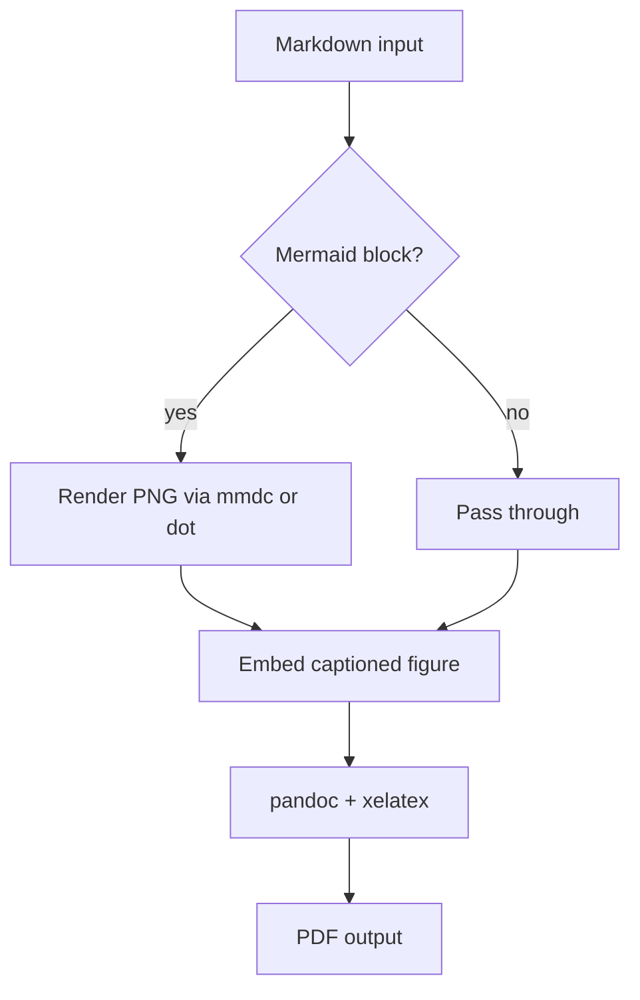

# md2x Sample Document

This sample exercises the full pipeline: headings, prose, a code block, a
table, and a Mermaid flowchart that gets rendered to a captioned figure.

## Pipeline Overview

The converter resolves local binaries, renders each Mermaid block to PNG, then
hands a rewritten Markdown file to pandoc + xelatex.



## Code

```python
def greet(name: str) -> str:
    return f"Hello, {name}!"
```

## Table

| Stage   | Tool     | Output  |
|---------|----------|---------|
| Render  | dot/mmdc | PNG     |
| Typeset | xelatex  | PDF     |

## Closing

If you can read this as a PDF with the diagram above rendered as an image, the
pipeline works end to end.
